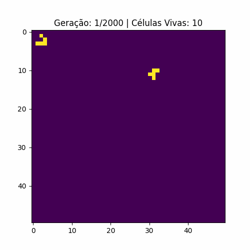
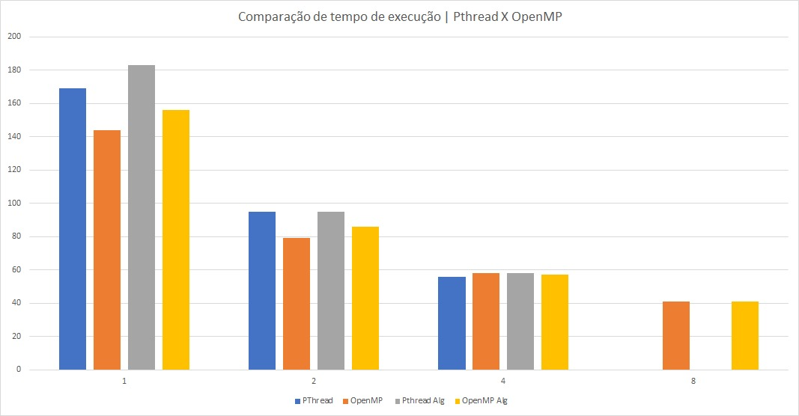
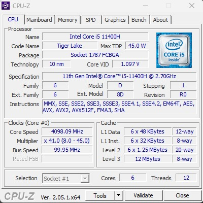
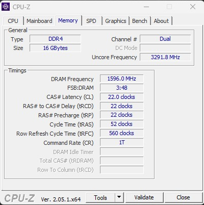

# Rainbow Game of Life

Este repositório contém o código-fonte do Rainbow Game of Life, um algoritmo celular desenvolvido como parte de uma atividade para a disciplina de Programação Concorrente e Distribuída (PCD). O Rainbow Game of Life é uma variação do famoso Jogo da Vida de Conway, no qual células em uma grade evoluem de acordo com regras simples.

## Autores

- [Bruno Pires](https://www.github.com/psbruno)
- [Gabriel Almeida](https://www.github.com/garpereira)
- [Matheus Silva](https://www.github.com/matheuxito)

## Objetivo

O principal objetivo deste projeto é demonstrar a aplicação de programação multithread para otimizar o desempenho do algoritmo do Jogo da Vida, permitindo uma simulação mais rápida e eficiente.

## Funcionamento do Algoritmo

O Rainbow Game of Life segue as regras clássicas do Jogo da Vida de Conway. As células em uma grade bidimensional evoluem de acordo com as seguintes regras:

1. Qualquer célula viva com menos de 2 vizinhos vivos morre, como se estivesse de solidão.
2. Qualquer célula viva com 2 ou 3 vizinhos vivos continua viva na próxima geração.
3. Qualquer célula viva com mais de 3 vizinhos vivos morre, como se estivesse superpopulada.
4. Qualquer célula morta com exatamente 3 vizinhos vivos se torna uma célula viva, como por reprodução.

A configuração inicial da matriz é a seguinte:

- Inicie a geração inicial do tabuleiro (array) a partir da posição [1, 1] com uma figura de um Glider, onde as células vazias correspondem ao valor zero (0.0) e as células preenchidas correspondem ao valor um (1.0), conforme a figura abaixo:

```
0 1 0
0 0 1
1 1 1
```

- Além disso, adicione a figura de um R-pentomino a partir da linha 10 e coluna 30, da seguinte forma:

```
0 1 1
1 1 0
0 1 0
```

Visualização do funcionamento do algoritmo:

<br>

## Resultados de Tempo

Os resultados de tempo foram obtidos a partir de uma comparação entre diferentes implementações do Rainbow Game of Life, variando o número de threads. O gráfico a seguir mostra a comparação entre o número de threads (eixo X) e o tempo em segundos (eixo Y) necessário para simular as 2000 gerações:

<br>

## Configurações de Hardware

O algoritmo foi executado em um computador com as seguintes configurações:

- Processador:

<br>

- Memória RAM:

<br>

- Sistema Operacional: Windows 11

## Licença

Este projeto é licenciado sob a MIT. Consulte o arquivo [LICENSE](LICENSE) para obter mais detalhes.

---

Divirta-se explorando o Rainbow Game of Life e experimentando com suas próprias configurações! Se tiver alguma dúvida ou sugestão, sinta-se à vontade para entrar em contato com os autores.

**Agradecemos por visitar nosso repositório!**